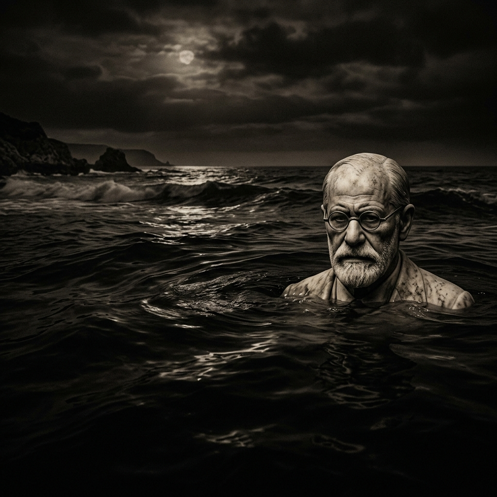



  

# THE-FREUD-ARCHIVE
### İnsan Zihninin Derinlikler Psikolojisi ve Bilinçdışının Ontolojisi

> "Kendi içimize inmek, dünyanın en tehlikeli yolculuğudur. Çünkü orada, yüzleşmekten en çok korktuğumuz canavarla; yani hiçbir sansürden geçmemiş ilkel doğamızla karşılaşırız."

---

# Bölüm 1: Topoloji ve Mimari - Zihnin Yapısal Analizi

Freud'un psikanalitik kuramının temelini zihnin anatomik değil, "topolojik" (uzamsal) bir model olarak tasvir edilmesi oluşturur. İnsan zihni, basit bir mekanik aygıt değil, farklı erişim seviyelerine ve çatışan kurallara sahip katmanlı bir yapıdır. Bu yapı tarihsel süreçte iki büyük model ile açıklanmıştır: **Topografik Model** (Buzdağı Metaforu) ve **Yapısal Model** (Kişiliğin Üçlü Yapısı).

## 1. Topografik Model (Erişim Düzeyleri)

Freud zihni, bilginin farkındalık düzeyine göre üç ana katmana ayırır. Bu, meşhur "buzdağı" metaforunun temelidir.

### 1.1 Bilinç (Conscious - C)
Buzdağının suyun üzerinde kalan, en küçük kısmıdır. Şu anda farkında olduğumuz, mantıklı düşünebildiğimiz, algıladığımız her şey burada yer alır. Ancak Freud'a göre bilinç, zihnin ana motoru değil, sadece bir "gözlem sahası" veya yansıma alanıdır. Kararların alındığı yer burası değildir.

### 1.2 Ön-Bilinç (Preconscious - Pcs)
Suyun hemen altındaki seviyedir. Şu an aktif olarak düşünmediğimiz ama istediğimizde (veya dikkatimizi verdiğimizde) kolayca bilince çağırabildiğimiz bilgileri içerir. Örneğin: Telefon numaranız, dün ne yediğiniz veya ilkokul öğretmeninizin adı. Ön-bilinç, Bilinç ile Bilinçdışı arasında bir filtre veya "bekleme odası" görevi görür.

### 1.3 Bilinçdışı (Unconscious - Ucs)
Buzdağının devasa, karanlık alt kısmıdır. Zihnin en büyük ve en güçlü alanıdır. Bilinçdışı; mantığın, zamanın ve ahlakın olmadığı bir boyuttur.
*   **İçeriği:** Travmalar, bastırılmış anılar, ilkel dürtüler (cinsellik ve saldırganlık), utanç verici arzular ve korkular.
*   **İşleyişi:** Birincil süreç düşünme (primary process thinking) ile çalışır. Çelişkiler bir arada var olabilir. Mantıksal nedensellik veya zaman algısı (geçmiş, şimdi, gelecek) yoktur.
*   **Erişim:** Bilinçdışına doğrudan erişim imkansızdır. İçeriği ancak rüyalar, dil sürçmeleri, nevrotik semptomlar ve serbest çağrışım yoluyla, yani şifrelenmiş (kılık değiştirmiş) bir şekilde bilince sızabilir.

---

## 2. Yapısal Model (Sistemin Aktörleri)

1920'lerden sonra Freud, Topografik modelin zihinsel çatışmaları (örneğin nevrozları) tam olarak açıklayamadığını fark etti. Bir şeyi "bastıran" gücün de bilinçdışı olabileceğini gördüğünde, zihni işlevsel aktörlere bölen **Yapısal Model'i (İd, Ego, Süperego)** geliştirdi.

### 2.1 İd (Es / O) - "Biyolojik Temel ve İlkel Güç"
İd, kişiliğin biyolojik bileşenidir. Doğuşta var olan tek sistemdir ve tamamen bilinçdışıdır.
*   **Çalışma Prensibi:** **Haz İlkesi (Pleasure Principle)**. İd, ne pahasına olursa olsun acıdan kaçınmak ve derhal hazza ulaşmak ister. Gecikmeye tahammülü yoktur.
*   **Doğası:** İd'de değer yargısı, iyi/kötü veya ahlak yoktur. Dürtüsel, irrasyonel ve hayvansaldır.
*   **Analoji:** Bir arabanın motoru gibidir; muazzam bir güç üretir ama nereye gideceğini bilemez.

### 2.2 Süperego (Über-Ich / Üst-Ben) - "Toplumsal Savunma Hattı"
Sistemin en son gelişen parçasıdır (yaklaşık 3-5 yaşlarında, Oidipal karmaşanın çözülmesiyle oluşur). Ebeveynlerin ve toplumun ahlaki kurallarının, ideallerinin ve yasaklarının içselleştirilmiş halidir.
*   **Çalışma Prensibi:** **Kusursuzluk ve Ahlak İlkesi**.
*   **Bölümleri:**
    *   *Vicdan:* Neyi yapmamamız gerektiğini dikte eder. İhlal edildiğinde suçluluk (guilt) duygusu yaratır.
    *   *Ego-İdeali:* Ne olmamız gerektiğini dikte eder. Ulaşılmadığında utanç (shame) duygusu yaratır.
*   **Doğası:** Süperego, İd kadar katı ve mantıksız olabilir. Çoğu zaman bilinçdışı düzeyde çalışır ve acımasız bir yargıç gibi davranır.

### 2.3 Ego (Ich / Ben) - "Yönetici ve Arabulucu"
İd'in gerçek dışı talepleri ile dış dünyanın fiziksel sınırları ve Süperego'nun katı ahlaki kuralları arasında denge kurmaya çalışan "Yönetici" (Executive) birimdir.
*   **Çalışma Prensibi:** **Gerçeklik İlkesi (Reality Principle)**. İd'in arzularını reddetmez, ancak bu arzuların tatminini dış dünyanın koşulları uygun olana kadar erteler veya toplumsal olarak kabul edilebilir yollar bulur (Yüceltme).
*   **Doğası:** Rasyoneldir, mantıklıdır ve problem çözücüdür. İkincil süreç düşünme (secondary process thinking) ile çalışır.
*   **Analoji:** Atın (İd) üzerindeki binici (Ego) gibidir. Atın gücünü kullanır ama ona yön vermeye çalışır; ancak at bazen çok güçlü olduğunda binici onun gittiği yere gitmek zorunda kalır.

## 3. Sistem İçi Çatışma ve Anksiyete

Bu üç yapı (İd, Ego, Süperego) sağlıklı bir zihinde uyum içinde çalışırken, nevrotik bir zihinde sürekli savaş halindedirler. Ego bu baskılara dayanamadığında **Anksiyete (Kaygı)** ortaya çıkar.
Anksiyete, Ego'ya "zihinsel bütünlüğün bozulma tehlikesi" olduğunu bildiren bir uyarıdır. Bu uyarı alındığında Ego, kendini korumak için **Savunma Mekanizmalarını** devreye sokar. (Bkz. 03-Savunma_Mekanizmalari).

---

# Bölüm 2: Dürtüler ve Termodinamik - Zihinsel Enerjinin Ekonomisi

Psikanalitik kuram, kökeninde bir "enerji" modelidir (Ekonomik Model). Freud, dönemin fizik bilimindeki termodinamik yasalarından derinden etkilenmiştir (özellikle enerjinin korunumu kanunu). Zihin de kapalı bir enerji sistemi olarak çalışır. Bu sistemdeki yakıta **Psişik Enerji** denir ve zihnin tüm faaliyetleri bu enerjinin yönetimine dayanır.

## 1. Dürtü (Trieb) Kavramı

Freud, biyolojik içgüdüleri zihinsel dünyamıza bağlayan köprüye "Dürtü" (Trieb / Drive) adını verir. Dürtü, bedensel bir ihtiyacın (örneğin açlık, cinsellik) zihindeki psikolojik temsilidir.

Bir dürtünün dört temel bileşeni vardır:
1.  **Kaynak (Source):** Bedenin içindeki fiziksel bir ihtiyaç veya uyarılma hali.
2.  **Amaç (Aim):** Bu uyarılma halini ortadan kaldırmak, yani eski denge (homeostazi) durumuna dönmek.
3.  **Nesne (Object):** Dürtünün tatminini sağlayacak kişi, nesne veya eylem.
4.  **İtici Güç (Impetus):** Dürtünün şiddeti, yarattığı baskı ve aciliyet hissi.

Sistem, uyaranlardan arınmış, "sıfır tansiyon" (Nirvana İlkesi) haline dönmek ister. Tansiyon (gerilim) arttıkça hazsızlık (Unlust), tansiyon düştüğünde ise haz (Lust) yaşanır.

## 2. Dürtülerin İkiliği: Eros ve Thanatos (Son Dönem Kuramı)

Freud'un kariyeri boyunca dürtü teorisi evrim geçirmiştir. 1920'de yazdığı ufuk açıcı eseri *Haz İlkesinin Ötesinde* (Beyond the Pleasure Principle) ile dürtüleri iki büyük, evrensel ve kozmik kampa ayırmıştır.

### 2.1 Eros (Yaşam Dürtüleri)
Eros, hayatta kalmaya, birleştirmeye, çoğalmaya ve yaratmaya hizmet eden tüm dürtülerin toplamıdır.
*   **İşlevi:** Hücreleri bir arada tutmak, yaşamı sürdürmek, türün devamlılığını sağlamak.
*   **Bileşenleri:** Cinsellik dürtüleri, kendini koruma içgüdüleri.
*   **Enerjisi: Libido.** Eros'un arkasındaki psişik enerjiye libido denir. Libido, cinsel ve yaratıcı enerjinin toplamıdır.

### 2.2 Thanatos (Ölüm Dürtüsü)
Freud'un en tartışmalı ve en karanlık kavramıdır. Bütün canlı organizmaların kendi inorganik (cansız) başlangıçlarına, yani huzura (hiçliğe) dönme yönünde gizli, kör bir eğilimi olduğunu öne sürer.
*   **İşlevi:** Yıkmak, parçalamak, ayırmak, gerilimi tamamen sıfırlamak.
*   **Klinik Kanıtları:** Kendini tekrar eden travmalar (Yineleme Zorlantısı), mazoşizm, sadizm, yıkıcılık, savaşlar.
*   **Dışa Vurumu:** Ölüm dürtüsü içeriye yöneldiğinde kendini yok etme, dışarıya (nesnelere) yöneldiğinde ise saldırganlık ve yıkıcılık (agresyon) olarak ortaya çıkar.

## 3. Katheksis (Yatırım) ve Anti-Katheksis

Sistemin enerjisi sınırlıdır. Bu enerjinin nasıl dağıtıldığı, zihnin sağlığını belirler.

*   **Katheksis (Cathexis):** Psişik enerjinin (libidonun) bir nesneye, kişiye veya fikre yönlendirilmesi (yatırım yapılması). Örneğin; bir kişiye aşık olduğunuzda, libidonuzun büyük bir kısmını o kişiye "yatırırsınız".
*   **Anti-Katheksis (Karşı-Yatırım):** İd'in tehlikeli bir dürtüsünü (katheksisini) durdurmak, bastırmak için Ego veya Süperego tarafından harcanan enerjidir.

**Sistemin Çöküşü (Nevroz):** Eğer kişi çok fazla enerjiyi Anti-Katheksis'e (bastırmaya) harcarsa, hayatı yaşamak (Eros) için gerekli olan enerji kalmaz. Zihin fakirleşir, kişi nevrotik hale gelir. Psikanalizin amacı, bastırmaya harcanan bu enerjiyi serbest bırakmak ve Ego'nun emrine sunmaktır.

---

# Bölüm 3: Savunma Mekanizmaları

Bilinçdışının ilkel dürtüleri (İd) bilince çıkmaya çalıştığında veya Süperego aşırı suçluluk yüklediğinde, Ego büyük bir baskı altında kalır. Bu baskı "Anksiyete" (Kaygı) olarak algılanır. Ego'nun çökmemesi ve gerçeklikle bağının kopmaması (psikoza girmemesi) için otonom çalışan bazı **Savunma Mekanizmaları (Defense Mechanisms)** devreye girer.

Bu mekanizmalar, acı veren gerçeği veya tehdidi çarpıtarak, inkar ederek veya bilinçdışına iterek Ego'yu koruyan psikolojik zırhlardır. Tamamı **bilinçdışı** düzeyde çalışır; kişi bunları uyguladığının farkında değildir.

## Temel Savunma Hatları (Savunmalar)

### 1. Bastırma (Repression)
Tüm savunma mekanizmalarının "şahıdır" ve en temel olanıdır. Kabul edilemez dürtülerin, travmatik anıların veya utanç verici düşüncelerin Ego tarafından aktif olarak bilinçdışına (arşivin en derinlerine) itilmesidir.
*   *Örnek:* Çocukluğunda istismara uğramış birinin bu olayı hiç hatırlamaması.
*   *Psikolojik Sorun:* Bastırılan materyal yok olmaz. Sürekli yukarı çıkmaya çalışır. Ego bunları aşağıda tutmak için çok fazla enerji (anti-katheksis) harcar. Nevrozların temel sebebi aşırı bastırmadır.

### 2. Yansıtma (Projection)
Kişinin kendi içindeki kabul edilemez veya suçluluk uyandıran dürtüyü, arzuyu veya karakter özelliğini bir başkasına atfetmesidir (İçerideki tehdidi dışarıya kopyalamak).
*   *Örnek:* Eşini aldatma arzusu taşıyan ama bunu kendine bile itiraf edemeyen birinin, sürekli eşini sadakatsizlikle suçlaması.

### 3. İnkar (Denial)
Dış dünyanın aşırı acı verici, travmatik gerçekliğini olduğu gibi algılamayı reddetmek. Zihin, gerçekliği algılamayı tamamen reddeder.
*   *Örnek:* Çocuğunu kaybeden bir annenin onun odasını yıllarca aynı şekilde tutup geri döneceğini beklemesi. Ya da ağır bir kanser teşhisi alan hastanın "Sadece küçük bir enfeksiyon" diyerek doktor doktor gezmesi.

### 4. Karşıt Tepki Kurma (Reaction Formation)
Kabul edilemez bir dürtünün bilince çıkmasını engellemek için, o dürtünün **tam tersi** olan tutum veya davranışları abartılı bir şekilde benimsemektir.
*   *Örnek:* İçsel olarak çok yoğun eşcinsel dürtüleri olan (ve bundan korkan) birinin aşırı ve saldırgan bir homofobik olması. Veya içindeki büyük öfke ve nefret dürtüsünü bastırmak için herkese aşırı, yapmacık derecede kibar davranan biri.

### 5. Yer Değiştirme (Displacement)
Bir dürtünün (genellikle saldırganlık) asıl hedefine yöneltilmesinin tehlikeli olduğu durumlarda, bu dürtünün daha az tehlikeli, daha "güvenli" bir yedek hedefe (ikame nesne) yönlendirilmesidir.
*   *Örnek:* Patronuna öfkelenen ama kovulma korkusuyla ona cevap veremeyen adamın, eve gidip karısına bağırması veya köpeğini tekmelemesi.

### 6. Yüceltme (Sublimation) - En Olgun Savunma
Freud'a göre en sağlıklı, en olgun savunma mekanizmasıdır. İd'in ilkel dürtülerinin (saldırganlık veya cinsellik) enerjisinin alınarak, toplum tarafından kabul edilebilir, faydalı, sanatsal veya bilimsel faaliyetlere dönüştürülmesidir.
*   *Örnek:* Yoğun sadistik/kesme biçme dürtüleri olan birinin bunu yücelterek çok başarılı bir cerrah olması. Yoğun cinsel arzuların sanata, resme veya müziğe aktarılması. Freud'a göre **medeniyet, yüceltilmiş dürtülerin toplamından ibarettir.**

### 7. Rasyonalizasyon (Mantığa Bürüme)
Gerçek (ama kabul edilemez) motivasyonları, mantıklı, kabul edilebilir bahaneler veya "iyi nedenler" bularak örtbas etmektir.
*   *Örnek:* Çok istediği işe alınmayan birinin "Zaten o şirketin çalışma saatleri çok kötüydü, iyi ki olmadı" demesi (Kedi-ciğer meselesi).

---

## Nevrozların Anatomisi
Nevroz, Ego'nun gerçeklikle bağını tamamen koparmadan, İd'in dürtüleriyle savaşırken verdiği kayıpların (semptomların) adıdır. Bastırma başarısız olmaya başladığında, bastırılan içerik kılık değiştirerek yüzeye çıkar. Fobiler, obsesyonlar, histeri krizleri; hepsi bastırılmış materyalin ve ona karşı Ego'nun kurduğu savunma savaşının kalıntılarıdır. Kliniğe gelen hasta, bu savaşta enerjisi tükenmiş olan zihindir.

---

# Bölüm 4: Bilinçdışının Dili - Rüyalar ve Sürçmeler

Bilinçdışı doğrudan incelenemez; onun doğası ancak bilince sızan şifreli mesajlar aracılığıyla deşifre edilebilir. Freud, günlük yaşamdaki sıradan hataların ve gece gördüğümüz rüyaların asla tesadüfi olmadığını, tam aksine bilinçdışının kusursuz bir şekilde çalışan "anlamlı" dışavurumları olduğunu kanıtlamıştır.

## 1. Rüyaların Yorumu (Traumdeutung, 1900)

Freud rüyaları, "Bilinçdışına giden kraliyet yolu" (Via Regia) olarak tanımlar. Rüyalar, beynin geceleri rastgele ürettiği sinirsel ateşlemeler değil; **bastırılmış bir arzunun (genellikle çocukluk kaynaklı) kılık değiştirmiş haldeki tatminidir.**

### Manifest İçerik vs. Latent İçerik
*   **Görünür (Manifest) İçerik:** Rüyayı görenin sabah uyandığında hatırladığı, çoğu zaman saçma, mantıksız ve kopuk olan senaryodur.
*   **Gizli (Latent) İçerik:** Rüyanın altındaki gerçek, yasaklı arzu, dürtü veya çözülmemiş çatışmadır. Psikanalizin asıl amacı görünür içeriği kazıyıp gizli içeriğe ulaşmaktır.

### Rüya Çalışması (Dream-Work) - Şifreleme Süreci
Uyku sırasında "sansür" mekanizması zayıflasa da tamamen kapanmaz. Gizli (yasak) arzular aynen bilince çıkarsa, kaygı yaratır ve kişiyi uyandırır (Kabus). Uykuyu korumak için, rüya çalışması bu yasak arzuları sansürden geçebilecek şekilde şifreler.

Rüya çalışmasının temel mekanizmaları:
1.  **Yoğunlaştırma (Condensation):** Birden fazla düşünce, kişi veya olay rüyada tek bir imgeye sıkıştırılır. (Rüyanızdaki kişi hem babanıza, hem patronunuza, hem de çocukluk arkadaşınıza aynı anda benzeyebilir).
2.  **Yer Değiştirme (Displacement):** Rüyadaki asıl önemli (ve duygusal açıdan yüklü) unsur, dikkati dağıtmak için çok önemsiz bir detaya kaydırılır. Tehlikeli duygu, zararsız bir nesneye aktarılır.
3.  **Sembolizasyon (Symbolization):** Soyut kavramlar veya yasaklı fikirler (çoğunlukla cinsel organlar ve eylemler) somut nesnelerle (kılıç, baston, yılan = fallus; kutu, mağara, çanta = rahim) ifade edilir.
4.  **İkincil Gözden Geçirme (Secondary Revision):** Uyanmaya yakın, Ego'nun uykuda da olsa rüyaya mantıklı, tutarlı bir senaryo kılıfı giydirme çabasıdır.

## 2. Gündelik Hayatın Psikopatolojisi (Parapraksis)

Freud, bilincin sadece uyurken değil, uyanıkken de bilince bilgi sızdırdığını gösterdi. Halk arasında "dil sürçmesi" (Freudian Slip / Parapraxis) olarak bilinen olaylar, aslında bilinçdışının sansürü delip gerçek niyeti haykırmasıdır.

*   **Dil ve Kalem Sürçmeleri:** Kişinin söylemek istemediği, ancak bilinçdışında aslında inandığı veya arzuladığı şeyi yanlışlıkla söylemesi. (Örneğin; patronuna "İyi sabahlar" demek isterken "İyi belalar" demek). Freud'a göre bunlar kaza değil, "başarılı" bilinçdışı eylemlerdir.
*   **Unutmalar:** İsimleri, randevuları veya niyetleri unutmak çoğunlukla pasif agresif bir tepkidir veya acı veren bir şeyden (bilinçdışı düzeyde) kaçınma arzusudur. Dişçi randevusunu unutmak bir hafıza sorunu değil, id'in acıdan kaçma prensibinin (bastırmanın) zaferidir.
*   **Sakarlıklar:** Sık sık bir şeyler kırmak, eşyaları kaybetmek veya kendine zarar vermek rastgele eylemler değil, bilinçdışı suçluluk duygusunun yarattığı, kişinin kendi kendini cezalandırma mekanizmalarının dışa vurumudur.

Bu rüyalar ve sürçmeler, zihnin derinliklerinde hangi çatışmaların arka planda kişiyi meşgul ettiğini gösteren eşsiz verilerdir.

---

# Bölüm 5: Klinik Vakalar - Kuramı İnşa Eden Semptomlar

Psikanaliz kuramı soyut felsefi bir ofiste değil, kliniğin o acımasız ve kaotik ortamında doğmuştur. Freud'un teorilerini formüle etmesini sağlayan, nevrozun uçurumundan düşen veya oradan dönen ünlü hastalardır. Bu hastalar, zihnin savunma mekanizmalarının çöktüğü ve bilinçdışının şifreli bir şekilde yüzeye çıktığı laboratuvar ortamını sunmuşlardır.

İşte Psikanaliz tarihinin (ve arşivin) en önemli klinik log kayıtları:

## 1. Anna O. (Bertha Pappenheim) - "Konuşma Kürünün" Doğuşu
Freud'un değil, akıl hocası Josef Breuer'in hastasıdır, ancak psikanalizin başlangıç noktası (Sıfırıncı Vaka) kabul edilir.
*   **Semptomlar:** Su içememe (hidrofobi), felç, körlük, sağırlık, anadilini (Almanca) unutup sadece İngilizce konuşma, halüsinasyonlar. Bu belirtilerin hiçbir fiziksel/nörolojik temeli yoktu (Histeri).
*   **Analiz:** Breuer, Anna'yı hipnotize edip semptomların ilk ortaya çıktığı anılara (travmalara) geri götürdüğünde, Anna'nın bunları hatırlayıp yoğun bir duyguyla ifade etmesi (Katarsis) semptomları yok ediyordu. Anna bu sürece "Baca Temizliği" (Chimney sweeping) veya "Konuşma Kürü" (Talking cure) adını verdi.
*   **Kuramsal Çıktı:** Fiziksel hastalıkların altında bastırılmış psikolojik travmalar yatabilir. Duygusal boşalım (Abreaction) iyileştiricidir. Freud daha sonra hipnozu bırakıp, hastanın bilincini açık tuttuğu **Serbest Çağrışım** yöntemini bulacaktır.

## 2. Küçük Hans (Herbert Graf) - Çocukluk Cinselliği ve Oidipus
Freud'un sadece bir kez yüz yüze görüştüğü, tedaviyi büyük ölçüde babasıyla mektuplaşarak yürüttüğü 5 yaşındaki bir çocuk vakasıdır.
*   **Semptom:** Sokakta atların kendisini ısıracağına dair geliştirdiği şiddetli bir fobi. Eve hapsolmuştu.
*   **Analiz:** At, babayı sembolize ediyordu. Gözlük takan ve ağzının etrafı siyah olan atların (babasının gözlüğü ve bıyığı) onu ısıracağı korkusu, aslında annesine duyduğu cinsel/romantik sevgi nedeniyle babası tarafından iğdiş edileceği (kastrasyon kaygısı) korkusunun yer değiştirmiş (displacement) haliydi.
*   **Kuramsal Çıktı:** Oidipus Kompleksi ve çocukluk dönemi cinselliğinin varlığının kanıtlanması. Nevrotik fobilerin altında yatan yer değiştirme mekanizmasının keşfi.

## 3. Fare Adam (Sıçan Adam - Ernst Lanzer) - Obsesif Kompulsif Nevroz
Psikanaliz tarihinin en detaylı analizlerinden biridir.
*   **Semptom:** Babasına ve çok sevdiği nişanlısına korkunç bir işkence yapılacağına dair saplantılı düşünceler (Obsesyonlar). (Kurbanın üzerine bir tencere içinde fareler bağlanması ve farelerin bedeni kemirmesi). Bu düşünceleri engellemek için anlamsız ve tekrarlayan ritüeller (Kompulsiyonlar) yapıyordu.
*   **Analiz:** Fare Adam'ın babasına karşı derin ve bastırılmış bir nefreti/düşmanlığı vardı. Bu nefret öylesine korkutucuydu ki, bunu aşırı bir sevgi, endişe ve ritüellerle kapatmaya (Karşıt Tepki Kurma) çalışıyordu. Dürtü (saldırganlık), Ego'nun korumalarını aşıp saplantılı bir fantezi olarak bilince sızıyordu.
*   **Kuramsal Çıktı:** Obsesif Kompulsif Bozukluğun (OKB) altındaki sevgi/nefret ikircikliliği (Ambivalans). Dürtü yalıtımı (İzolasyon) ve Yap-Boz (Undoing) savunma mekanizmalarının analizi.

## 4. Kurt Adam (Sergei Pankejeff) - İlkel Sahne (Primal Scene)
*   **Semptom:** Bağırsak sorunları, şiddetli depresyon ve çocukluktan kalma rüyalar. En meşhuru, yatağının karşısındaki ağacın dallarında sessizce kendisine bakan altı veya yedi tane beyaz kurt gördüğü kabustur.
*   **Analiz:** Freud, bu rüyanın (ve Sergei'in nevrozunun) temelinde hastanın 1.5 yaşındayken anne ve babasını cinsel ilişkiye girerken (tergo pozisyonunda) görmesi (İlkel Sahne) olduğunu iddia etti. Beyaz kurtlar, ailenin iç çamaşırlarını, kurtların bakışı hastanın kendi dikizleme (röntgencilik) arzusunun yansıtılmasını, sessizlik ise büyük bir dehşeti simgeliyordu.
*   **Kuramsal Çıktı:** Çocukluk travmalarının gecikmiş etkisi. Rüya analizinin ne kadar derine inebileceğinin gösterilmesi ve inkar (Verleugnung) mekanizmasının deşifre edilmesi.

## 5. Başkan Schreber (Daniel Paul Schreber) - Psikoz ve Paranoya
Freud Schreber'i hiç görmedi, Schreber'in kendi yazdığı anılar (Denkwürdigkeiten eines Nervenkranken) üzerinden onu analiz etti.
*   **Semptom:** Schreber saygın bir hakimdi. Birdenbire Tanrı tarafından seçildiğine, kadınsılaştırıldığına (eşcinsel fanteziler) ve Tanrı'nın ondan yeni bir insan ırkı yaratacağına dair devasa ve karmaşık bir hezeyan (sanrı) sistemi geliştirdi. Güneşe bakabiliyor ve kuşlarla telepati kurabiliyordu.
*   **Analiz:** Freud'a göre Schreber'in hezeyanlarının kökeninde bastırılmış pasif eşcinsel arzuları (babasına ve doktoru Flechsig'e yönelik) yatıyordu. "Onu (erkek olarak) seviyorum" (bastırılan düşünce), "Ondan nefret ediyorum" (karşıt tepki), "O benden nefret ediyor ve beni mahvetmek istiyor" (yansıtma ve paranoya). Psikotik hezeyanlar, aslında yıkılmış bir gerçekliği yeniden inşa etme çabasıydı.
*   **Kuramsal Çıktı:** Paranoyanın ve şizofreninin dinamiklerinin açıklanması. Psikozun, libidonun dış dünyadan çekilip (megalomani) kişinin kendi egosuna hapsolması olarak tanımlanması.

---

# Bölüm 6: Uygarlığın Huzursuzluğu - Medeniyet, Din ve Sosyoloji

Freud, psikanalizi sadece bireyin nevrozlarını tedavi eden tıbbi bir yöntem olarak bırakmamış, aynı araçları insanlık tarihini, dini, sanatı ve medeniyeti analiz etmek için de kullanmıştır. O'na göre, bireyin zihinsel çatışmaları ile toplumun kültürel yapıları arasında yapısal bir paralellik (makro-mikro ilişkisi) vardır.

## 1. Uygarlığın Huzursuzluğu (Das Unbehagen in der Kultur, 1930)

Bu kitap, Freud'un en karamsar ve en etkili kültürel eleştirisidir. Temel argümanı şudur: **İnsan doğası gereği medeniyete düşmandır, ancak medeniyet olmadan da hayatta kalamaz.**

*   **Trajik Takas:** İnsan, güvenlik, düzen ve toplumsal bir arada yaşama karşılığında içgüdüsel (cinsel ve saldırgan) özgürlüğünden vazgeçmek zorundadır. Uygarlık, bireyin vahşi dürtülerinin (İd'in) amansızca bastırılması ve kısıtlanması üzerine inşa edilmiştir.
*   **Nevrozların Bedeli:** İlkel dürtülerin (özellikle Thanatos'un getirdiği saldırganlığın) dışa vurumu yasaklandığı için, bu enerji içeriye (Ego'ya) döner. Uygarlık geliştikçe Süperego (toplumsal ahlak) giderek daha acımasızlaşır.
*   **Sonuç:** Medeniyet geliştikçe, bireyin suçluluk duygusu ve "huzursuzluğu" (nevrozu) kaçınılmaz olarak artar. Bizler, kurduğumuz bu devasa, düzenli ve güvenli yapının içinde mutlu olmaya değil, nevrotik olmaya mahkumuz. Medeniyet, bastırılmış ve yüceltilmiş dürtülerin bir müzesidir.

## 2. Totem ve Tabu (1913) - Toplumun Kökeni

Freud bu eserinde antropolojik verilere dayanarak toplumsal kurumların (din, ahlak, ensest yasağı) psikanalitik kökenini araştırır. Darwin'in "ilkel sürü" hipotezinden yola çıkar.

*   **İlk Günah (Primal Horde):** Tarih öncesi çağlarda, tüm kadınlara (annelere/kız kardeşlere) sahip olan güçlü, zorba bir "İlk Baba" vardı. Genç erkekler (oğullar) cinsel açlık ve kıskançlık içinde birleştiler, babayı öldürdüler ve yamyamca bir ritüelle onu yediler (Babaya duyulan öfke ve onun gücünü içselleştirme).
*   **Suçluluk ve Totem:** Babayı öldürdükten sonra devasa bir suçluluk (guilt) duygusuna kapıldılar. Babalarının anısını, kutsal saydıkları bir hayvanla (Totem) simgeleştirdiler. Totem hayvanının öldürülmesi ve yenmesi yasaklandı.
*   **Tabu (Ensest Yasağı):** Kardeşler birbirlerini öldürmemek ve babanın yerini almamak için aralarında bir anlaşma yaptılar: Kendi klanlarındaki kadınlara (anne ve kız kardeşlere) dokunmayacaklardı. Bu, **ensest tabusunun** ve dolayısıyla dışarıdan evliliğin (eksogami) başlangıcıdır.
*   **Sonuç:** Din, ahlak ve toplumsal yasaların temelinde, bu ilk ensest arzusu ve babanın öldürülmesinin getirdiği evrensel suçluluk duygusu (Oidipus Kompleksinin toplumsal ölçeği) yatar.

## 3. Bir Yanılsamanın Geleceği (Die Zukunft einer Illusion, 1927) - Dinin Psikanalizi

Freud'a göre Din, Tanrı'nın varlığının kanıtı değil, insanın en derin korkularının ve çaresizliğinin yarattığı bir savunma mekanizması, bir "yanılsamadır" (Illusion).

*   **Evrensel Çaresizlik:** İnsan doğanın güçleri (hastalık, doğal afetler, ölüm) karşısında çaresizdir. Tıpkı küçük bir çocuğun korktuğunda babasına sığınması gibi, insanlık da kozmik yalnızlığı ve ölüm korkusu karşısında sığınacak devasa, koruyucu bir "Göksel Baba" figürü (Tanrı) yaratmıştır.
*   **Nevroz Olarak Din:** Freud dini, insanlığın "evrensel obsesif nevrozu" olarak tanımlar. Dini ritüeller (dualar, oruçlar, tapınmalar), obsesif bir hastanın kaygısını bastırmak için yaptığı anlamsız tekrarlardan (kompulsiyonlardan) yapısal olarak farklı değildir.
*   **Gelecek:** Freud, bilimin ve aklın (Logos) gelişmesiyle insanın bu çocukluk dönemi nevrozunu aşıp, Tanrı yanılsamasına ihtiyaç duymadan, gerçeklikle yüzleşebilecek kadar olgunlaşmasını umut eder.

---

# Bölüm 7: Ayrışmalar ve Çatışmalar - Ortodoksiden Kopuşlar

Freud psikanalizi kurduğunda, etrafında "Viyana Psikanaliz Derneği" adı altında parlak öğrencilerden oluşan bir halka toplandı. Ancak Freud, teorilerini (özellikle cinsellik, libido ve ölüm dürtüsü kavramlarını) esnetilmez dogmalar olarak gördüğü için, kendi öğrencilerinin eleştirilerine tahammül edemedi. Bu "sapkınlıklar" sonucunda psikanaliz ağacı büyük dallara ayrıldı.

İşte Freudyen ana akımdan (ortodoksiden) kopan en önemli figürler ve teorileri:

## 1. Carl Gustav Jung (Analitik Psikoloji)
Freud'un "veliahtı" ve favori öğrencisiydi. Ancak 1913'te tamamen koptular. Jung'un temel itirazları Freud'un cinselliği aşırı vurgulaması ve bilinçdışının doğası üzerineydi.

*   **Kişisel değil, Kolektif Bilinçdışı:** Jung'a göre insan zihni sadece kendi çocukluk travmalarının çöplüğü (kişisel bilinçdışı) değildir. Bunun altında, tüm insanlık tarihinden (hatta hayvan atalarımızdan) bize miras kalan, evrensel bir veri tabanı olan **Kolektif Bilinçdışı** vardır.
*   **Arketipler:** Kolektif bilinçdışı boş değildir; "Arketipler" (ilk örnekler) ile doludur (Gölge, Persona, Anima/Animus, Bilge İhtiyar, Kahraman). Dünyanın birbirini hiç görmemiş tüm mitolojilerinde, dinlerinde ve rüyalarında aynı sembollerin (örneğin Ejderha, Yaratılış seli, Kurtarıcı) ortaya çıkması bu arketiplerin kanıtıdır.
*   **Libidonun Genişletilmesi:** Jung için Libido sadece cinsel enerji değil, genel bir "yaşam ve psişik enerji"dir. Maneviyat, sanat ve din, bastırılmış cinselliğin yüceltilmesi değil, insanın doğuştan gelen temel ve sağlıklı ihtiyaçlarıdır.

## 2. Alfred Adler (Bireysel Psikoloji)
Psikanaliz çevresinden kopan ilk büyük isimdir (1911). Adler, insanı biyolojik dürtülerin kurbanı olarak gören determinist Freudyen yapıya karşı çıktı ve insanı sosyal bir varlık olarak yeniden tanımladı.

*   **Aşağılık Kompleksi (Inferiority Complex):** Adler'e göre insan davranışının temel motifi cinsellik değil, "Aşağılık Duygusu"dur. İnsan yavrusu dünyaya tamamen aciz, zayıf ve yetişkinlere bağımlı (aşağılık bir pozisyonda) gelir. Tüm insan hayatı, bu aşağılık duygusunu telafi etme ve "Üstünlük Çabası"na (Striving for superiority) dönüşme serüvenidir.
*   **Sosyal İlgi:** Sağlıklı bir insan üstünlük çabasını bencilce değil, "Sosyal İlgi" (topluma fayda sağlama) çerçevesinde gerçekleştirir. Nevrotik kişi ise güç peşinde koşarken toplumu yok sayan, aşağılık kompleksinin altında ezilen kişidir.
*   **Teleoloji:** Freud geçmişe (çocukluk travmalarına) bakarken, Adler geleceğe (hedeflere, amaçlara) bakar. İnsanı geçmişi değil, gelecekte kurguladığı "kurgusal hedefler" yönlendirir.

## 3. Karen Horney (Feminist Psikanalitik İtiraz)
Horney, Freud'un teorilerindeki kadın karşıtı (fallosantrik) ve biyolojik determinist vurgulara karşı çıkarak psikanalize sosyo-kültürel bir boyut getirdi.

*   **Penis Kıskançlığı'na Reddiye:** Freud'a göre kız çocukları erkek organına sahip olmadıkları için "Penis Kıskançlığı" (Penis Envy) çekerler ve kadın psikolojisi bu eksiklik üzerine kurulur. Horney bunu reddetti: Kadınların kıskandığı şey biyolojik bir organ değil, toplumun erkeklere sunduğu **güç, ayrıcalık ve bağımsızlık**tır.
*   **Rahim Kıskançlığı (Womb Envy):** Horney, tam tersine, erkeklerin kadınların hamile kalma, doğurma ve hayat yaratma yeteneğini bilinçdışı düzeyde kıskandıklarını (Rahim Kıskançlığı) öne sürdü. Erkeklerin sanatta, bilimde ve iş dünyasında bu kadar hırslı olmalarının sebebi, doğurma yeteneklerinin olmamasını "üreterek" telafi etme çabasıdır.
*   **Temel Anksiyete:** Nevrozların kaynağı Oidipus kompleksi değil, sevgisiz veya tecrit edilmiş çocukluk yaşantılarının yarattığı yalnızlık ve çaresizlik hissidir (Temel Anksiyete).

## 4. Modern Nöro-Psikanaliz (Mark Solms)
Günümüzde psikanaliz ile sinirbilimin (neuroscience) birleştiği cephedir.
*   Freud'un rüyalar, hafıza, bilinçdışının gücü ve duygusal beyin ile ilgili varsayımları, fMRI ve PET scan gibi modern beyin görüntüleme teknikleriyle test edilmektedir.
*   Şaşırtıcı bir şekilde, Freud'un İd (Limbik sistem), Ego (Prefrontal korteks) gibi yapısal tasvirlerinin, beynin anatomik mimarisiyle büyük oranda örtüştüğü kanıtlanmaktadır. (Bilinçdışının geri dönüşü).

---

# Yas ve Melankoli (Trauer und Melancholie, 1917)

Freud'un zihin işleyişini, kaybı ve depresyonu (melankoliyi) anlattığı, psikanaliz tarihinin en vurucu ve en şiirsel metinlerinden biridir. Freud bu makalede, sevilen bir nesnenin (insan, ideal, vatan, özgürlük) kaybına verilen iki farklı tepkiyi karşılaştırır: Biri sağlıklı (Yas), diğeri patolojik (Melankoli).

## 1. Yas (Mourning) - Sağlıklı Kayıp Süreci
Yas, sevilen birinin ölümüne veya çok değer verilen soyut bir idealin kaybına verilen normal reaksiyondur.
*   **Mekanizma:** Sevilen nesne artık fiziksel gerçeklikte yoktur. Ego, gerçeklik testini (Reality Testing) yapar ve nesnenin yok olduğuna ikna olur.
*   **Süreç (Hiper-Katheksis):** Yas süreci inanılmaz derecede acı verici ve yavaştır. Çünkü kaybedilen nesneye daha önce yatırılmış olan bütün psişik enerji (libido), o nesneden tek tek, anı anı, parça parça geri çekilmelidir. Bu geri çekme işlemine "Yas çalışması" (Work of mourning) denir.
*   **Sonuç:** Yas çalışması tamamlandığında, Ego yeniden özgürleşir. Geri çekilen libido, yeni bir nesneye (yeni bir aşka, yeni bir amaca) yatırılmak üzere serbest kalır. Dünyanın içi boşalmıştır ama Ego sapasağlamdır.

## 2. Melankoli (Melancholia) - Patolojik Çöküş
Melankoli (modern adıyla Majör Depresyon), görünürde yasla aynı semptomlara sahiptir (derin acı, hayattan kopuş, uykusuzluk). Ancak melankolide yastan farklı olarak iki kritik semptom vardır:
1.  **Bilinçdışı Kayıp:** Melankolik kişi *kimi* kaybettiğini bilebilir ama o kişide *neyi* kaybettiğini (bilinçdışı düzeyde) bilmez. Kayıp tam olarak idrak edilememiştir.
2.  **Ego'nun Fakirleşmesi (En Önemli Fark):** Yasta *dış dünya* boş ve anlamsız hale gelirken; Melankolide *Ego'nun (Benliğin) kendisi* boş, değersiz ve anlamsız hale gelir. Hasta sürekli kendini suçlar, aşağılar, ahlaki olarak kendini en adi insan olarak görür (Öz-yıkım).

### Melankolinin Dinamiği: Gölgenin Ego'nun Üzerine Düşmesi
Peki melankolik kişi neden sürekli kendine saldırır ve kendini suçlar? Freud'un dâhice tespiti şudur:
Melankoliğin kendisine yönelttiği ağır suçlamalar ve hakaretler, aslında **kendisine değil, kaybettiği (ama aslında içten içe nefret ettiği veya hayal kırıklığına uğradığı) nesneye (kişiye) yöneliktir.**

*   **Süreç:** Kişi, kaybettiği nesneden libidosunu çekmek yerine, o nesneyi yutar (İçe-Atım / Introjection). Kaybedilen nesneyi Ego'sunun içine yerleştirir.
*   **Çatışma:** Nesneye duyulan (ve bastırılmış olan) öfke, şiddet ve nefret; şimdi içeride, kişinin kendi Egosuna (çünkü nesne artık Egonun içindedir) yönelir. Süperego, içselleştirilmiş bu nesneye (dolayısıyla Ego'ya) sadistçe saldırmaya başlar.
*   **Söz (Alıntı):** *"Böylece nesnenin gölgesi Ego'nun üzerine düştü... "* (Thus the shadow of the object fell upon the ego).
*   **İntiharın Psikanalizi:** Melankolideki intihar arzusu, aslında kişinin kendini öldürme arzusu değil; içselleştirdiği, kendini terk eden veya hayal kırıklığına uğratan *o diğer kişiyi* (nesneyi) içeriden öldürme arzusudur. İntihar, maskelenmiş bir cinayettir.

## Sonuç
Yas, gerçekliğin kabulü ve libidonun özgürleşmesidir. Melankoli ise, kaybın inkar edilmesi, kaybedilen nesnenin zihinde hapsedilmesi ve ona duyulan öfkenin kişinin kendi benliğini parçalamasıdır. Melankoli, içe dönmüş bir narsisistik cinayettir.

---

# Narsisizm Üzerine Bir Giriş (Zur Einführung des Narzissmus, 1914)

Psikanaliz tarihinde devrim yaratan, Freud'un libido teorisini kökünden değiştirdiği ve Ego kavramına yepyeni bir boyut kazandırdığı temel metindir. Bu makaleye kadar Freud, libidonun (psişik enerjinin) her zaman dışarıdaki nesnelere yöneldiğini (Nesne Libidosu) düşünüyordu. Ancak şizofreni (Dementia Praecox) hastalarını incelerken bir sorunla karşılaştı: Bu hastalar libidolarını dış dünyadan tamamen çekmişlerdi. Peki bu enerji nereye gitmişti?

Freud'un cevabı sarsıcıydı: **Enerji, dış dünyadan çekilip Ego'nun kendisine (Benliğe) yatırılmıştı.** Bu keşif, "Narsisizm" kavramını psikanalizin merkezine oturttu.

## 1. Birincil ve İkincil Narsisizm

Narsisizm tekil bir patoloji değil, zihnin gelişiminin yapısal bir parçasıdır.

### Birincil Narsisizm (Primal Narcissism)
Anne karnındaki ve yeni doğan bebeğin zihinsel durumudur. Bebek henüz "Ben" ve "Dış Dünya" (Anne) ayrımını yapamaz. Kendisini evrenin merkezi, her şeye gücü yeten (omnipotent) bir varlık sanır. Bütün libido Ego'da toplanmıştır. Bebek için dışarıda sevecek bir nesne yoktur; çünkü o her şeydir. *"His Majesty the Baby"* (Majesteleri Bebek) dönemi budur. Bu, tamamen sağlıklı ve hayatta kalmak için zorunlu bir dönemdir.

Gelişimle birlikte, çocuk dış dünyanın kurallarını öğrenir, çaresizliğini fark eder ve Egosundaki libidonun bir kısmını anne-babaya, oyuncaklara, dış dünyaya yatırım olarak yöneltir. Buna **Nesne Libidosu** denir.

### İkincil Narsisizm (Secondary Narcissism) - Patoloji
Yetişkinlikte dış dünyada ağır bir travma, reddedilme veya hayal kırıklığı yaşandığında; kişi dış dünyaya yatırdığı libidosunu (sevgisini/enerjisini) geri çeker. Dış dünya çok tehlikeli veya acı vericidir. Çekilen bu devasa enerji tekrar Ego'nun üzerine yığılır.
*   Kişi çocukluktaki o "her şeye gücü yeten" megalomanik duruma geri döner (Regresyon).
*   Şizofreni, paranoya ve ağır megalomani; dış dünyadan çekilen nesne libidosunun, Ego'yu devasa bir şekilde şişirmesinin (İkincil Narsisizm) sonucudur. Hasta sadece kendisini sever, sadece kendisiyle ilgilenir, dış dünyadaki kimseyle bağ kuramaz.

## 2. Ego İdeali (Ego-Ideal)
Narsisizm makalesinin en büyük buluşlarından biri "Ego İdeali" kavramıdır.
Bebek büyüdükçe o ilk baştaki "mükemmel" ve "kusursuz" narsisistik halini (Birincil Narsisizmi) yitirir. Ebeveynlerin eleştirileri ve toplumun kuralları onun kusursuzluk yanılsamasını yıkar.

Ancak insan zihni o ilk kusursuzluk halini asla unutmaz ve ondan vazgeçmek istemez. Freud'a göre kişi, kaybettiği o narsisistik mükemmelliği yeniden kurmak için zihninde bir **"İdeal Benlik" (Ego İdeali)** inşa eder.
*   Eskiden *kendisinin* mükemmel olduğuna inanan çocuk; şimdi mükemmel olmak için ulaşması gereken, toplumun, ahlakın ve ebeveynlerin beklentilerinden oluşan bir *ideal* yaratır.
*   Gelecekteki tüm çabamız (başarılı olmak, ahlaklı olmak, güzel/yakışıklı olmak) aslında bu Ego İdealine ulaşarak, çocukluktaki o "kayıp narsisistik cennete" geri dönme çabasıdır.

## 3. Aşk ve Narsisizm Seçimleri

Freud aşkı iki farklı nesne seçimi üzerinden açıklar:
1.  **Anaklitik (Dayanmacı) Tip Seçim:** Kişi, çocukluğunda kendisine bakan, onu besleyen veya koruyan kişilerin (anne-baba) benzerlerini eş olarak seçer. Bu, nesne libidosunun dışa yöneldiği daha olgun bir aşktır. "Beni koruyan/besleyen kadını/adamı seviyorum."
2.  **Narsisistik Tip Seçim:** Kişi aslında *kendisini* (veya kendisinin bir versiyonunu) sever. Kendi Egosunu karşı tarafa yansıtır.
    *   Kişi şunları sever: *Kendisi* (şu anki hali), *Eskiden olduğu kişi* (geçmişi), *Olmak istediği kişi* (Ego ideali) veya *Kendisinin bir parçası olan kişi* (çocuğu).
    *   Aşırı narsisistik aşklar (veya obsesif tutkular), karşı tarafı gerçek bir insan olarak görmekten çok, kişinin kendi eksik Ego İdealini karşı tarafta tamamlamaya çalışmasının bir sonucudur.

**Libidonun Termodinamiği:** Freud burada enerji ekonomisini netleştirir: Ego libidosu ile Nesne libidosu ters orantılıdır. Ne kadar çok dışarıyı (başkasını) sever ve yatırım yaparsak, Ego o kadar boşalır ve fakirleşir (Aşık olan kişi kendini unutur, zayıflar). Ne kadar çok kendimizi seversek (Narsisizm), dış dünya ve diğer insanlar bizim için o kadar anlamsızlaşır. Sağlık, bu ikisi arasındaki dengededir.

---

# Bölüm 9: Psikoseksüel Gelişim Evreleri - Dürtülerin Tarihçesi

Freud'un en çok tepki çeken ve yanlış anlaşılan teorilerinden biri çocukluk dönemi cinselliğidir. Freud'a göre "cinsellik" (libido), sadece yetişkinlikte ortaya çıkan genital bir eylem değil, doğumdan itibaren var olan ve bedenin farklı bölgelerinde (erojen bölgeler) odaklanan geniş bir "haz arayışı" enerjisidir.

Kişiliğimizin temeli, yaşamın ilk 5 yılındaki bu evrelerde libidonun nasıl yönetildiğine bağlı olarak şekillenir. Eğer bir evrede aşırı haz alınır veya aşırı mahrumiyet yaşanırsa, libido o evreye "takılıp kalır". Buna **Fiksasyon (Saplantı)** denir ve yetişkinlikteki karakter yapımızı veya nevrozlarımızı belirler.

## 1. Oral Dönem (0-1.5 Yaş)
*   **Erojen Bölge:** Ağız, dudaklar, dil.
*   **Haz Kaynağı:** Emme, ısırma, yutma, çiğneme. Bebek dünyayı ağzıyla tanır ve en büyük haz (ve güvenlik) kaynağı anne memesidir.
*   **Psikolojik Temalar:** Güven, bağımlılık, alıcılık. İd tamamen egemendir.
*   **Fiksasyon (Saplantı) Sonuçları:**
    *   *Oral-Pasif Karakter:* Emme döneminde saplanma. Yetişkinlikte aşırı bağımlı, saf, başkalarından sürekli bir şeyler "alan/bekleyen", aşırı yeme, sigara içme, tırnak yeme, öpüşme bağımlılığı.
    *   *Oral-Agresif Karakter:* Diş çıkarma ve ısırma döneminde saplanma. Yetişkinlikte laf sokan (iğneleyici/sarkastik konuşan), agresif, kötümser, tartışmacı ve insanları "sözleriyle ısıran" karakter yapısı.

## 2. Anal Dönem (1.5 - 3 Yaş)
*   **Erojen Bölge:** Anüs ve çevresi.
*   **Haz Kaynağı:** Dışkıyı tutma (kas kontrolü) ve bırakma. Çocuk ilk defa bedeni üzerinde kontrol sahibi olur ve çevresiyle (ebeveynleriyle) ilk büyük iktidar çatışmasını tuvalet eğitimi üzerinden yaşar.
*   **Psikolojik Temalar:** Kontrol, inatçılık, otoriteye karşı çıkma, bağımsızlık. Ego'nun gelişimi hızlanır.
*   **Fiksasyon (Saplantı) Sonuçları:**
    *   *Anal-Tutucu (Retentive) Karakter:* Tuvalet eğitiminin çok sert ve cezalandırıcı olması sonucu çocuk dışkısını tutmayı (itaat etmeyi ama pasif-agresif bir inatla) seçer. Yetişkinlikte: Aşırı titiz, cimri, saplantılı derecede düzenli, inatçı, kuralcı, esneklik payı olmayan OKB (Obsesif Kompulsif) eğilimli yapı. (Dışkısını tutan cimri, parasını tutan cimriye dönüşür).
    *   *Anal-Dışa Atıcı (Expulsive) Karakter:* Çocuğun dışkısını uygunsuz yerlere yaparak isyan etmesi. Yetişkinlikte: Dağınık, düzensiz, fevri, kurallara uymayan, yıkıcı ve savurgan yapı.

## 3. Fallik Dönem (3 - 6 Yaş) - En Kritik Evre
*   **Erojen Bölge:** Cinsel organlar (Fallus).
*   **Haz Kaynağı:** Cinsel organları keşfetme, mastürbasyon. Kız ve erkek anatomi farkının fark edilmesi.
*   **Psikolojik Temalar:** **Oidipus Kompleksi** ve **Elektra Kompleksi**. Psikanalizin merkez üssü burasıdır.
    *   *Erkek Çocuk (Oidipus Kompleksi):* Annesine karşı bilinçdışı bir cinsel/romantik arzu duyar ve babasını bir rakip olarak görüp onu ortadan kaldırmak ister. Ancak güçlü babasının bunu fark edip penisini keseceğinden korkar (**Kastrasyon/İğdiş edilme Kaygısı**). Bu dehşetengiz korku yüzünden çocuk annesinden vazgeçer ve babasıyla özdeşim kurar ("Onu yenemiyorsam onun gibi olmalıyım"). Bu özdeşimle birlikte babanın ahlaki kuralları içselleştirilir ve **Süperego** doğar.
    *   *Kız Çocuk (Elektra Kompleksi/Penis Kıskançlığı):* Kız çocuğu bir penisinin olmadığını fark eder ve bunun için anneyi suçlar (Penis Kıskançlığı). Babasına yönelir ve ondan sembolik olarak bir penis (bir erkek bebek) elde etmek ister. Sonunda anneyi yenemeyeceğini anlar ve anneyle özdeşim kurarak Süperego'yu oluşturur. (Freud'a göre kızların kastrasyon korkusu olmadığı için süperegolari erkeklere göre daha zayıftır - bu görüş Horney gibi feminist analistler tarafından reddedilmiştir).
*   **Fiksasyon Sonuçları:** Aşırı kibir, kendini kanıtlama çabası (maço/don juan tavırlar), baştan çıkarıcılık, histeri ve otorite figürleriyle sürekli çatışma veya onlara aşırı boyun eğme.

## 4. Latent (Gizül) Dönem (6 Yaş - Ergenlik)
*   **Erojen Bölge:** Yok.
*   **Süreç:** Fallik dönemdeki devasa fırtına ve Oidipus çatışması, kurulan ağır savunma mekanizmalarıyla (Süperego'nun baskısıyla) yeraltına itilir (bastırılır). Libido cinsel hedeflerden çekilir ve yüceltilir (Sublimation).
*   **Psikolojik Temalar:** Enerji; okul, oyun, arkadaşlıklar, hobiler ve sosyalleşmeye harcanır. Kendi cinsiyetinden arkadaş grupları kurulur. Cinsellik bir süreliğine "uykuya" yatar.

## 5. Genital Dönem (Ergenlik ve Sonrası)
*   **Erojen Bölge:** Cinsel organlar.
*   **Süreç:** Ergenlikte hormonal değişimlerle birlikte libido uykudan uyanır. Oidipal çatışmalar yeniden yüzeye çıkar ancak bu sefer sağlıklı olan; ensest (aile içi) nesnelerden kopup, libidonun dış dünyadaki uygun partnerlere (karşı cinse veya eşcinsel yönelimlere) yönlendirilmesidir.
*   **Hedef:** Sevmek (Eros) ve çalışmak. Sadece narsisistik (kendi bedenine yönelik) hazlardan kurtulup, başka bir insanla gerçek, olgun ve üremeye/yaratıcılığa yönelik bir bağ kurabilmek. Freud'a göre sağlıklı insan: "Sevebilen ve çalışabilen" insandır.

---

# Psikanalitik Sözlük (A-Z) - Temel Kavramlar

Freud ve ardıllarının yarattığı psikanalitik jargon, zihnin derinliklerini haritalamak için oluşturulmuş özel bir dildir. Arşivi tam olarak okuyabilmek için psikanalizin temel terimlerini bilmek gerekir.

### A
*   **Abreaction (Duygusal Boşalım):** Bastırılmış, travmatik bir anının bilince getirilmesi sırasında yaşanan yoğun duygusal boşalma ve rahatlama anı (Katarsis).
*   **Agresyon (Saldırganlık):** Ölüm dürtüsünün (Thanatos) dış dünyaya, nesnelere veya diğer insanlara yöneltilmiş, yıkıcı hali.
*   **Ambivalans (İkirciklilik):** Bir kişiye veya nesneye karşı aynı anda birbirine tamamen zıt iki güçlü duygu (örn: hem sevgi hem nefret) besleme durumu. (Nevrozların temelindeki enerji sıkışmasıdır).
*   **Anksiyete (Kaygı):** İd'in dürtülerinin bilince sızma tehlikesi karşısında Ego'nun verdiği acı verici, uyarıcı "sistem tehlikede" sinyali.

### B
*   **Bastırma (Repression):** Kabul edilemez isteklerin, travmatik anıların Ego tarafından zorla bilinçdışına itilmesi ve orada tutulması. En temel savunma mekanizmasıdır.
*   **Birincil Süreç Düşünme (Primary Process Thinking):** İd'in ve bilinçdışının çalışma prensibidir. Mantık dışı, zamansız, rüyalardaki gibi kopuk ve tamamen haz odaklı işleyiştir.

### E
*   **Ego:** Gerçeklik ilkesine göre çalışan, İd'in dürtüleri ile dış dünya ve Süperego arasında arabuluculuk yapan yönetici zihinsel yapı.
*   **Elektra Kompleksi:** Kız çocuğunun fallik dönemde babasına duyduğu bilinçdışı romantik/cinsel arzu ve anneyle olan rekabeti. (Jung tarafından isimlendirilmiş, Freud Oidipus Kompleksi terimini her iki cinsiyet için kullanmayı tercih etmiştir).
*   **Eros:** Yaşam, cinsellik, çoğalma ve birleştirme eğiliminde olan yapıcı dürtülerin toplamı.

### F
*   **Fiksasyon (Saplantı):** Psikoseksüel gelişim evrelerinden birinde (örn: oral veya anal) yaşanan aşırı doyum veya aşırı mahrumiyet sonucu, libidonun (enerjinin) o evrede takılı kalması.

### H
*   **Haz İlkesi (Pleasure Principle):** İd'in çalışma kuralı. Acıdan ne pahasına olursa olsun kaçmak ve gerilimi hemen sıfırlamak (anında tatmin olmak) eğilimi.

### I-İ
*   **İd (Es):** Kişiliğin en ilkel, tamamen bilinçdışı, dürtüsel (hayvansal) isteklerle dolu biyolojik çekirdeği.
*   **İkincil Süreç Düşünme (Secondary Process Thinking):** Ego'nun rasyonel, mantıklı, problem çözücü, nedenselliğe dayanan bilinçli düşünme biçimi.
*   **İzolasyon (Yalıtma):** Bir anının veya düşüncenin (genellikle travmatik), sahip olduğu duygusal yükten (acı/korku) koparılması. Anı hatırlanır ama kişi hiçbir duygu hissetmez.

### K
*   **Kastrasyon Kaygısı (İğdiş Edilme Korkusu):** Erkek çocuğun, anneye duyduğu yasak arzu yüzünden babası tarafından cinsel organının kesilerek cezalandırılacağına dair hissettiği devasa bilinçdışı terör.
*   **Katheksis (Cathexis):** Psişik enerjinin (libidonun) bir nesneye, kişiye veya fikre yatırılması, yönlendirilmesi.

### L
*   **Libido:** Eros'un (yaşam dürtülerinin) arkasındaki temel psişik, cinsel ve yaratıcı enerji.
*   **Latent İçerik (Gizli İçerik):** Rüyanın görünürdeki saçma hikayesinin altında yatan, sansürlenmiş gerçek (yasak) arzu veya düşünce.

### N
*   **Narsisizm:** Libidonun dış dünyadan (nesnelerden) çekilip kişinin kendi Egosuna (Benliğine) yatırılması. Kendini sevme.
*   **Nevroz:** İd'in bastırılmış dürtüleri ile Ego'nun savunma mekanizmaları arasındaki çatışmanın sonucunda ortaya çıkan semptomlar (fobiler, obsesyonlar, histeri) bütünü. Psikozun aksine nevrotik hastanın gerçeklikle bağı kopmamıştır.

### O-Ö
*   **Oidipus Kompleksi:** Çocuğun karşı cins ebeveynine duyduğu bilinçdışı cinsel/romantik çekim ve kendi cinsinden ebeveynine duyduğu yıkıcı rekabet/nefret. Tüm nevrozların "çekirdek kompleksi"dir.
*   **Ölüm Dürtüsü (Thanatos):** Canlı organizmanın inorganik/cansız duruma (huzura/hiçliğe) dönme yönündeki gizli eğilimi; saldırganlığın ve yıkıcılığın kaynağı.

### P
*   **Parapraksis:** Dil ve kalem sürçmeleri, sakarlıklar, nedensiz unutkanlıklar. Bilinçdışı arzunun bilinci yararak anlık olarak dışa vurması.
*   **Psikoz:** Ego'nun id'in baskılarına veya dış dünyanın acımasızlığına dayanamayıp tamamen parçalanması, gerçeklikle bağın kopması durumu (Şizofreni, Paranoya).

### R
*   **Regresyon (Gerileme):** Yoğun stres veya kaygı durumunda, kişinin psikolojik olarak daha önceki (daha güvenli) bir psikoseksüel gelişim evresine (örn: anal veya oral döneme) geri dönmesi ve o dönemin davranışlarını (tırnak yeme, alt ıslatma, aşırı inatçılık) sergilemesi.

### S-Ş
*   **Serbest Çağrışım (Free Association):** Psikanalitik tedavinin temel yöntemi. Hastanın, mantıklı veya ayıp olup olmadığını sansürlemeden, aklına gelen her şeyi terapiste söylemesi.
*   **Süperego (Üst-Ben):** Ebeveynlerin ve toplumun ahlaki, kültürel kurallarının içselleştirilmiş hali. Vicdanı ve Ego-İdealini barındırır. Sürekli kusursuzluk talep eder.

### T
*   **Transferans (Aktarım):** Hastanın çocukluğunda kendisi için önemli olan figürlere (anne/baba) karşı hissettiği güçlü duyguları (aşk, nefret, öfke, bağlılık) bilinçdışı olarak terapiste yöneltmesi. Terapinin en kritik motorudur.

### Y
*   **Yüceltme (Sublimation):** İd'in cinsellik veya saldırganlık gibi ilkel dürtülerinin engellenmeyip, toplum tarafından kabul edilebilir, yüksek değerli alanlara (sanat, bilim, spor) dönüştürülmesi.

---

# Dostoyevski ve Baba Katli (Dostojewski und der Parrizid, 1928)

Freud'un edebiyat ve sanat üzerine yazdığı en çarpıcı ve tartışmalı metinlerden biridir. Bu makalede Freud, Karamazov Kardeşler romanının yazarını, yani Fyodor Dostoyevski'nin bizzat kendisini analiz masasına yatırır. Freud'a göre Dostoyevski'nin dehası, şüphe götürmez bir biçimde onun ağır nevrotik yapısına, özellikle de çözülememiş **Oidipus Kompleksine** dayanır.

## 1. Dört Farklı Dostoyevski
Freud, Dostoyevski'nin karmaşık kişiliğini dört farklı cepheden inceler:
1.  **Yaratıcı Sanatçı:** Psikanalizin karşısında en çaresiz kaldığı, açıklayamadığı alandır. Sanatçının yeteneği psikanalizle çözülemez.
2.  **Nevrotik (Hasta):** Epilepsi krizleri ve şiddetli suçluluk duyguları.
3.  **Ahlakçı:** Çektiği onca acıya rağmen sonunda en katı dini (Ortodoks) ve devlete (Çar) itaatkâr ahlakı benimsemesi.
4.  **Günahkâr:** Sürekli kumar oynaması, yıkıcı tutkuları ve karanlık dürtüleri.

## 2. Epilepsinin Psikanalizi
Dostoyevski'nin meşhur sara (epilepsi) krizleri, Freud'a göre tamamen organik (nörolojik) bir hastalık değildi. Bu krizler, **"Histerik-Epilepsi"** (Duygulanımsal Epilepsi) adı verilen psikolojik kökenli nöbetlerdi.

*   **Baba Katli Arzusu:** Freud, bu krizlerin temelinde Dostoyevski'nin zalim ve otoriter babasına duyduğu yoğun nefretin ve bilinçdışındaki "babayı öldürme" (Parricide) arzusunun yattığını iddia eder.
*   **Ölüm Taklidi Olarak Nöbet:** Oidipal yasa şudur: "Babayı öldürmek istiyorsan, sen ölmelisin." Dostoyevski'nin epilepsi krizleri, babasına karşı duyduğu ölümcül öfkenin kendi üzerine dönmesi ve **kendi kendini cezalandırmak için "ölümü taklit etmesi"ydi.** (Nöbet sırasındaki bilinç kaybı ve kaskatı kesilme).
*   Babası gerçekten de kendi serfleri (köylüleri) tarafından vahşice öldürüldüğünde, Dostoyevski'nin bilinçdışı fantezisi (babamın ölmesini istiyorum) gerçeğe dönüşmüş oldu. Bu durum onda korkunç bir suçluluk duygusu yarattı ve epilepsi krizleri bu cinayetten sonra asıl yıkıcı boyutlarına ulaştı.

## 3. Karamazov Kardeşler ve Evrensel Suçluluk
Freud, dünya edebiyatının üç büyük şaheserinin (Sofokles'in *Kral Oidipus*'u, Shakespeare'in *Hamlet*'i ve Dostoyevski'nin *Karamazov Kardeşler*'i) tesadüfi olmayan bir şekilde **aynı temayı**, yani **baba katlini** işlediğine dikkat çeker.

*   Karamazov Kardeşler romanında babayı öldüren kişi Smerdyakov'dur. Ancak Freud'a göre gerçek suçlu o değildir. İvan (akıl yoluyla), Dmitri (tutkuyla) ve hatta Alyoşa (pasifliğiyle) bu cinayeti arzulamıştır.
*   Dostoyevski, romandaki tüm kardeşlere kendi Oidipal suçluluk duygusunu paylaştırmıştır. Babanın öldürülmesi, insanlık tarihinin ortak "ilk günahıdır" (Bkz. Totem ve Tabu) ve Dostoyevski bu evrensel bilinçdışı yükü en saf haliyle edebiyata aktaran bir elçidir.

## 4. Kumar Tutkusu ve Kendini Cezalandırma
Dostoyevski'nin yıkıcı kumar bağımlılığı (Rulet), Freud'a göre bir para kazanma arzusu değil, **kendini mahvetme ve cezalandırma** mekanizmasıdır.
*   Kumar, psikanalitik açıdan bir tür kompulsif mastürbasyon eşdeğeridir. (Ellerin sürekli meşgul olması, yükselen gerilim, doruk noktası ve ardından gelen pişmanlık).
*   Dostoyevski, ancak her şeyini kaybedip, tamamen dibe vurduktan ve vicdanını (Süperego'sunu) yatıştırdıktan sonra yeniden yazı yazabilme (yüceltme) enerjisini bulabiliyordu. Kumar, suçluluk duygusunun kefaretini ödeme ayiniydi.

---

# Das Unheimliche (Tekinsizlik / The Uncanny, 1919)

Freud'un estetik, edebiyat ve korku psikolojisi üzerine yazdığı, modern kültür ve sanat teorisini en derinden etkileyen metinlerden biridir. Bu makale, neden bazı şeylerin (örneğin canlanmış gibi duran oyuncak bebeklerin, balmumu heykellerin, doppelgänger'ların -çift gezerlerin-, ya da karanlıkta aniden hareket eden gölgelerin) içimizde saf bir korkudan ziyade, "ürpertici", "tüyler ürpertici" ve **tekinsiz** bir his uyandırdığını analiz eder.

## 1. Heimlich ve Unheimlich Etimolojisi
Freud analize kelimelerin kökeninden başlar:
*   **Heimlich:** Almancada "eve ait olan, tanıdık, evcil, güvenli, gizli tutulan, mahrem" anlamlarına gelir.
*   **Unheimlich (Tekinsiz):** Bu kelimenin zıttıdır. "Yabancı, ürkütücü, gizli kalması gerekirken açığa çıkmış olan."

Freud'un dâhice tespiti şudur: *Heimlich* kelimesi, anlamı derinleştikçe zıttı olan *Unheimlich* ile birleşir. Yani "Tekinsiz" olan şey, bize tamamen yabancı olan, dışarıdan gelen bir şey değildir. Tam aksine, **bir zamanlar bize çok tanıdık olan (eve ait olan), ancak bastırma süreciyle yabancılaşmış ve şimdi bastırıldığı yerden kılık değiştirerek geri dönmüş olan şeydir.** (The return of the repressed).

## 2. Tekinsizliğin Psikolojik Kaynakları

Freud, edebiyattaki (özellikle E.T.A. Hoffmann'ın 'Kum Adam' hikayesi) örnekler üzerinden tekinsizliğin temelinde yatan psikanalitik mekanizmaları deşifre eder.

### A. Animistik Düşünce ve Düşünce-Tümgüçlülüğü (Omnipotence of Thoughts)
Çocukluğumuzda veya insanlığın ilkel dönemlerinde evrendeki her şeyin canlı olduğuna (animizm) ve sadece düşünerek dünyayı değiştirebileceğimize (büyüsel düşünce) inanırdık. Büyüdükçe (veya medenileştikçe) rasyonel akıl bu inançları bastırdı. Ancak yetişkinlikte, bu rasyonel perdenin arkasından aniden ilkel inançlarımızı doğrulayan bir olay yaşarsak (Örneğin; "Keşke şu adam ölse" diye düşündüğümüz gün adamın aniden ölmesi), müthiş bir tekinsizlik hissi yaşarız. Bastırılmış ilkel (narsisistik) inancımız canlanmıştır.

### B. Kastrasyon Kaygısı (Gözlerin Oyulması)
Hoffmann'ın "Kum Adam" hikayesinde, çocukların gözlerine kum serpip onları kör eden ürkütücü bir figür vardır. Freud, hikayedeki "gözleri kaybetme" veya "gözlerin oyulması" korkusunun, Oidipus kompleksinden kaynaklanan **İğdiş edilme (Kastrasyon) korkusunun** edebiyattaki yer değiştirmiş sembolik bir ifadesi olduğunu savunur. Organın kendisi yerine, yüksek değerli başka bir organa (gözlere) duyulan korku aktarılmıştır.

### C. Doppelgänger (Çift-Gezer / İkiz)
Edebiyatta veya rüyalarda insanın kendi kopyasıyla, ikiziyle karşılaşması en büyük tekinsizlik motiflerinden biridir.
*   Başlangıçta (birincil narsisizm evresinde) ruhun/ikizin varlığı, ölümü inkar etmek ve ölümsüzlüğü garantilemek için yaratılmış bir savunmaydı.
*   Ancak yetişkinlikte karşılaşılan Doppelgänger, ölümü yenen bir koruyucu değil, aksine **ölümün uğursuz bir habercisi** haline gelir. Yansımamız (ikizimiz), bastırdığımız tüm o karanlık, kabul edilemez arzuların ete kemiğe bürünmüş halidir ve Egomuzu tehdit eder.

### D. Yineleme Zorlantısı (Repetition Compulsion)
İnsanın elinde olmadan, sürekli olarak aynı çıkmaz sokağa girmesi, aynı sayıyı görmesi veya rüyada aynı labirentte kaybolması. Ego'nun rasyonel kontrolünün dışında, tıpkı Ölüm Dürtüsü (Thanatos) gibi şeytani ve otonom bir gücün bizi ele geçirdiği hissi, büyük bir tekinsizlik yaratır.

## Özet
Tekinsiz olan (Das Unheimliche), gerçekten "yeni" olan bir korku değildir. Zihnimizin karanlık bodrumlarına kilitlediğimiz, orada unutmaya çalıştığımız eski, tanıdık "çocukluk korkularımızın" veya "ilkel arzularımızın" aniden, tanıyamayacağımız maskeler takarak (canlanan bir bebek, karanlık bir ikiz, büyülü bir tesadüf olarak) bilincin kapısını çalmasıdır.

---

# Kitle Psikolojisi ve Ego Analizi (Massenpsychologie und Ich-Analyse, 1921)

Bu eser, Freud'un bireysel psikanalizi alıp sosyolojik ve politik bir düzleme (grup davranışlarına) taşıdığı köprü metnidir. Freud, Gustav Le Bon'un kitlelerin irrasyonel ve "sürü" benzeri doğası hakkındaki tespitlerini alır ve şu can alıcı soruyu sorar: **Neden ahlaklı ve rasyonel bireyler bir araya gelip bir "Kitle" (Kütle/Grup) oluşturduklarında, aniden rasyonelliklerini kaybedip, vahşi, düşüncesiz ve hatta cani bir organizmanın parçasına dönüşürler? Onları bir arada tutan yapıştırıcı güç nedir?**

Freud'un cevabı tek kelimedir: **Libido (Aşk).**

## 1. Kitleyi Bir Arada Tutan Güç: Libidinal Bağlar
Freud'a göre bir kilise, bir ordu, bir siyasi parti veya öfkeli bir kalabalık, sadece ortak bir çıkar veya "telkin" ile bir arada durmaz. Onları kaynaştıran şey, cinsel hedeflerinden saptırılmış (yüceltilmiş) erotik/libidinal bağlardır. Kitle içindeki bireyler, birbirlerine görünmez duygusal bağlarla tutunurlar. Kitle, libidonun sosyalleşmiş halidir.

## 2. Lider ve Ego İdeali'nin Değişimi
Kitle psikolojisinin kalbinde yer alan en çarpıcı Freudyen tespit şudur: Bireyin kitle içinde erimesi, onun kendi "Süperegosundan" ve "Ego İdealinden" vazgeçmesi anlamına gelir.

*   Normal bir bireyin içinde, onu yargılayan, ahlaki kurallar koyan bir **Ego İdeali / Süperego** vardır.
*   Birey bir kitleye (örneğin faşist bir lidere veya karizmatik bir komutana) bağlandığında, **kendi Ego İdealinin yerine dışarıdaki o Lideri koyar.**
*   Lider (Führer, Başkumandan, Dini Lider) artık bireyin vicdanının ve ahlakının yerini almıştır. Lider ne derse ahlak odur.
*   Bireyler (kitle) ortak bir lidere aşık oldukları (libidolarını ona yatırdıkları) için birbirleriyle eşitlenirler ve kardeş olurlar. "Hepimiz liderin çocuklarıyız."

Bu mekanizma, sıradan ve iyi kalpli bir insanın, üniformayı giydiğinde veya kitlenin arasına karıştığında kendi vicdanından azade olarak nasıl kolayca katliam yapabildiğini açıklar. Çünkü yargılayıcı Süperego devredilmiştir; cinayet emrini veren lider, yeni "vicdan"dır.

## 3. Hipnoz ve Aşk Olarak Kitle
Freud, kitlenin lidere olan bağlılığını, aşık bir insanın maşukuna (sevdiğine) duyduğu körü körüne bağlılığa veya hipnotize edilen kişinin hipnozitöre duyduğu tam teslimiyete benzetir.

*   **Aşık Olmak:** Kişi kendini değersizleştirir, tüm psişik yatırımını (libidoyu) sevdiği kişiye yöneltir. Aşık olunan kişi, eleştirilemez, kusursuz bir "İdeal" halini alır.
*   **Hipnoz:** Cinsel hedefleri tamamen dışlanmış bir aşk halidir.
*   **Kitle Lideri:** Kitle de lidere tam olarak böyle büyülenmiş bir şekilde bağlıdır. Kitle, liderden mantıklı kararlar veya rasyonel tartışmalar değil; dogmatik, mutlak ve güçlü yanılsamalar talep eder. Kitle, gerçeğe değil yanılsamaya (illüzyona) aşıktır.

## 4. İlkel Sürüye Dönüş
Freud'a göre yapılaşmış bir kitle (ordu/kilise vb.), Darwin'in antropolojik "İlkel Sürü" (Primal Horde) kavramının modern bir simülasyonudur.
Kitledeki her birey, aslında bilinçdışı bir düzeyde o mutlak güce sahip, kimseye boyun eğmeyen, korkutucu ama koruyucu "İlk Baba"yı aramaktadır. Karizmatik liderler, bu ilkel babanın psikolojik yansımalarıdır.

*Sonuç olarak Freud, kitleleşmenin insanı gerilettiğini (Regresyon) ve bireyin psişik gelişiminde en zor elde ettiği "Bağımsız Ego" yapısını, güvenli ve rahat bir aidiyet hissi uğruna nasıl kolayca yok ettiğini acımasızca teşhir eder.*

---

# Sigmund Freud'un Hayatı ve Entelektüel Serüveni

Sigmund Freud, zihnin coğrafyasını yeniden çizen, 20. yüzyılın en büyük düşünürlerinden ve psikanalizin kurucusudur. Hayatı, Viktorya dönemi ahlakının katı baskılarından sıyrılıp, insan ruhunun en karanlık ve "ayıp" kabul edilen dehlizlerine cesurca inen bir kâşifin öyküsüdür.

## 1. İlk Yıllar: Freiberg'den Viyana'ya (1856 - 1873)
Sigmund Freud, 6 Mayıs 1856'da Avusturya-Macaristan İmparatorluğu sınırları içindeki Freiberg'de (bugünkü Çekya'da Pribor) doğdu. Yahudi bir ailenin çocuğuydu. Babası Jacob Freud, yün tüccarıydı ve Sigmund onun üçüncü evliliğinden olan ilk oğluydu. Annesi Amalia, babasından çok daha gençti ve Freud'a "altın çocuğum" (mein goldener Sigi) diye hitap eden, ona büyük bir sevgi ve narsisistik bir özgüven aşılayan kişiydi.

Freud 4 yaşındayken ailesi ekonomik kriz nedeniyle Viyana'ya taşındı. Freud, ömrünün neredeyse tamamını (Nazi işgaline kadar, yaklaşık 78 yıl) bu şehirde geçirdi. Okul hayatı boyunca son derece parlak bir öğrenciydi, sınıf birincisiydi ve Yunanca, Latince, İbranice, Fransızca ve İngilizce öğrendi.

## 2. Nöroloji Laboratuvarından Kliniğe (1873 - 1885)
Viyana Üniversitesi Tıp Fakültesi'ne girdi. Başlangıçta felsefeye (özellikle Brentano'nun derslerine) ilgi duysa da, Ernst Brücke'nin fizyoloji laboratuvarında çalışmaya başladı. Freud'un buradaki bilimsel terbiyesi katı bir determinizme (nedenselliğe) dayanıyordu; ona göre zihinsel her sürecin organik bir temeli olmalıydı.

Mezun olduktan sonra Viyana Genel Hastanesi'nde çalıştı, nöroloji üzerine (özellikle omurilik anatomisi) önemli makaleler yazdı. Ancak akademik kariyer basamakları bir Yahudi için çok kapalıydı. Para kazanmak ve nişanlısı Martha Bernays ile evlenebilmek için özel muayenehane açmaya karar verdi.

## 3. Kokain, Charcot ve Hipnoz (1885 - 1895)
1884'te Freud, kokainin tıbbi kullanımları üzerine *Über Coca* adlı makaleyi yazdı. Kokainin mükemmel bir antidepresan ve ağrı kesici olduğuna (yanlışlıkla) inandı ve bunu arkadaşlarına, hastalarına ve kendisine önerdi. Yakın bir arkadaşının (Ernst von Fleischl-Marxow) kokain bağımlılığından ölmesi, Freud için büyük bir travma ve bilimsel bir utanç oldu.

1885'te Paris'e, Salpêtrière Hastanesi'ne giderek efsanevi nörolog **Jean-Martin Charcot** ile çalıştı. Charcot, histerinin (felç, körlük vb. fiziksel semptomlar gösteren ama organik temeli olmayan hastalık) kadınlara özgü bir "rahim hastalığı" olmadığını, erkeklerde de görülebildiğini ve **hipnoz** ile semptomların yok edilebildiğini gösterdi. Bu, Freud'un zihninde bir kıvılcım çaktırdı: *Demek ki zihnin, bedene hükmeden ve bilincin dışında çalışan devasa bir gücü vardı.*

## 4. Psikanalizin Doğuşu ve Oidipus (1895 - 1900)
Viyana'ya döndükten sonra eski dostu Josef Breuer ile histeri vakaları üzerinde çalıştı. Ünlü **Anna O.** vakası bu dönemin ürünüdür. 1895'te *Histeri Üzerine Çalışmalar* (Studien über Hysterie) kitabını yayınladılar.

Kısa süre sonra Freud, hipnozun her hastada işe yaramadığını gördü ve kendi devrimci tekniği olan **Serbest Çağrışım**'ı (Free Association) geliştirdi. Hastalar sadece bir divana uzanıyor ve akıllarına gelen her şeyi sansürsüzce anlatıyordu.

1896'da babasının ölümü, Freud'u derin bir melankoliye sürükledi. Bu krizden çıkmak için tarihteki ilk ve tek **Oto-Analiz'i (Kendi Kendini Analiz)** başlattı. Kendi rüyalarını ve anılarını kazıyarak, içindeki karanlık arzuları keşfetti ve ünlü **Oidipus Kompleksini** formüle etti: İnsan zihninin çekirdeğinde ensest ve cinayet arzuları yatıyordu.

1900 yılında başyapıtı *Rüyaların Yorumu* (Die Traumdeutung) yayımlandı. Bu kitapla birlikte **Psikanaliz** resmen doğmuş oldu.

## 5. Çarşamba Cemiyeti ve Büyük İhanetler (1902 - 1914)
Freud'un ünü yavaş yavaş yayılmaya başladı. Viyana'daki dairesinde her çarşamba günü bir grup aydın ve doktor toplanmaya başladı (Çarşamba Psikoloji Cemiyeti). Bu grup daha sonra Viyana Psikanaliz Derneği'ne dönüşecektir. Alfred Adler, Wilhelm Stekel ve Sandor Ferenczi gibi isimler bu gruptaydı.

1907'de Zürih'ten genç ve parlak bir psikiyatr Freud'a katıldı: **Carl Gustav Jung**. Freud, psikanalizin sadece "Viyanalı bir Yahudi icadı" olarak kalmaması için İsviçreli, Hıristiyan ve saygın Jung'u "veliahtı" ilan etti. Ancak Jung, libidonun cinsel doğasını reddedip tasavvufi/mitolojik (kolektif bilinçdışı) bir yöne kayınca, 1913'te yolları acı bir şekilde ayrıldı. Freud, teorisinin temel taşlarından (cinsellik ve çocukluk dürtüleri) asla taviz vermedi.

## 6. Savaş, Ölüm Dürtüsü ve Kanser (1914 - 1930)
Birinci Dünya Savaşı, Freud'un medeniyete olan inancını yerle bir etti. İnsanlığın vahşeti karşısında, zihnin sadece hayatta kalmaya (Eros) değil, yok etmeye ve ölüme (Thanatos) de programlı olduğunu fark etti. 1920'de *Haz İlkesinin Ötesinde*'yi yazarak Ölüm Dürtüsü kavramını ortaya attı.

1923'te Freud'a çene kanseri teşhisi kondu (günde 20'den fazla puro içiyordu). Hayatının geri kalan 16 yılında 33 kez ağır ameliyat geçirdi, çenesinin büyük kısmı alındı ve acı verici bir protez takmak zorunda kaldı. Ancak puro içmeyi, hasta bakmayı ve yazmayı asla bırakmadı.

## 7. Londra'ya Sürgün ve Veda (1938 - 1939)
1933'te Naziler Almanya'da iktidara geldiğinde ilk yaktıkları kitaplar arasında Freud'un eserleri ("Ruh yıkanmasına karşı!") vardı. Freud buna alayla şu cevabı verdi: *"Ne kadar ilerleme kaydettik! Ortaçağ'da olsak beni yakarlardı, şimdi sadece kitaplarımı yakmakla yetiniyorlar."*

1938'de Naziler Avusturya'yı ilhak edince (Anschluss), Gestapo Freud'un evini bastı, kızı Anna'yı sorguya çekti. Uluslararası diplomatik baskılar ve ödenen fidyeler sonucunda Freud ve ailesi zorlukla Londra'ya kaçabildi (Ancak geride kalan dört kız kardeşi toplama kamplarında yakılarak öldürülecekti).

Londra'da bir kahraman gibi karşılandı, ancak kanseri artık dayanılmaz bir boyuta ulaşmıştı. 23 Eylül 1939'da, dostu ve doktoru Max Schur'dan daha önce verdikleri bir sözü yerine getirmesini istedi. Schur'un uyguladığı yüksek dozda morfin ile Freud, hayatın anlamsız acısından kendi iradesiyle kurtularak, inorganik huzura (Thanatos'a) kavuştu.

---

# Sigmund Freud'un Kendi Sözlerinden (Alıntılar)

Bu klasör, psikanalizin kurucusunun insan doğasına, dine, aşka ve medeniyete dair kendi kaleminden dökülen en çarpıcı ve en karanlık aforizmaları içerir. Freud'un yazarlığı, sadece bilimsel bir kurulukta değil, edebi bir ustalık seviyesindedir (Kendisi Goethe Edebiyat Ödülü sahibidir).

## İnsan Doğası ve Zihin Üzerine
> "Kendi evimizin efendisi değiliz." *(İnsanın bilinçdışı dürtülerin esiri olduğunu anlatan meşhur tespiti)*

> "Gelişimimiz boyunca egomuz üç büyük ağır yara almıştır: İlkinde Kopernik, dünyanın evrenin merkezi olmadığını kanıtladı. İkincisinde Darwin, hayvanlarla aynı atadan geldiğimizi göstererek bizi doğanın efendiliği tahtından indirdi. Üçüncü ve en ağır yara ise Psikanaliz'den geldi: Psikanaliz, insana, kendi zihninin bile hâkimi olmadığını kanıtladı."

> "Nereye gittiysem benden önce oraya gitmiş bir şair buldum." *(Edebiyatın ve sanatın, psikanalizin çok öncesinde bilinçdışını keşfettiğini itirafı)*

> "Hiçbir fani sır tutamaz. Dudakları sussa bile parmak uçlarıyla konuşur; ihanet onun her hücresinden dışarı sızar." *(Gündelik hayatın psikopatolojisi ve bilinçdışının dışa vurumu üzerine)*

> "Bilinçaltı diye bir şey yoktur; bilincin farkında olmadığı, bastırılmış ama sürekli yüzeye çıkmak için fokurdayan bir cehennem vardır."

## Aşk ve Cinsellik Üzerine
> "İnsan sevdiği zaman, hiç olmadığı kadar savunmasızdır; sevdiğini kaybettiğinde ise hiç olmadığı kadar çaresiz." *(Yas ve Melankoli üzerine)*

> "Anatomi kaderdir." *(Oidipus kompleksi ve psikoseksüel gelişim bağlamında, bedensel cinsiyetin psikolojik yapıyı nasıl kaçınılmaz bir şekilde belirlediğine dair çok tartışılan sözü)*

> "Bir insana vazgeçilmez olduğunu hissettirdiğinizde, ilk vazgeçeceği kişi siz olursunuz." *(Narsisizm ve insan ilişkilerinin dinamikleri üzerine)*

> "Çiçekleri koparanlar, onları sevdiğini söyleyenlerdir; oysa gerçekten sevenler onları sular. İnsan sevgisi genellikle sevdiğini yok etme eğilimi taşır."

## Din ve Medeniyet Üzerine
> "Din, insanlığın evrensel obsesif nevrozudur. Çocukluktaki çaresizlik hissimizi bastırmak için yarattığımız dev bir illüzyondan (yanılsamadan) ibarettir." *(Bir Yanılsamanın Geleceği)*

> "Medeniyet, ilk defa bir insanın diğerine mızrak atmak yerine hakaret etmesiyle başlamıştır."

> "Bir insanın ahlaki yapısı, hissettiği suçluluk duygusunun büyüklüğüyle ölçülebilir. Nevrotik, en katı ahlaklıdır; çünkü en yoğun suçluluğu o hisseder."

> "Bazen bir puro, sadece bir purodur." *(Psikanalitik sembolizmin ve aşırı yorumlamanın sınırlarını hatırlatmak için -kendi pipo alışkanlığı sorulduğunda- söylediği iddia edilen ünlü söz)*

## Yaşam ve Ölüm Üzerine
> "Hayatın amacı ölümdür." *(Haz İlkesinin Ötesinde, Ölüm Dürtüsü/Thanatos teorisi)*

> "Eğer acıdan kaçmak istiyorsan, aşık olmamalısın. Ama aşık olmadığın zaman da yaşamanın bir anlamı kalmaz. Sağlıklı olmak, hem sevebilmek hem de çalışabilmektir."

> "Mutluluk, çok uzun süre birikmiş bir ihtiyacın aniden tatmin edilmesinden başka bir şey değildir. Doğası gereği, ancak anlık bir fenomen (olay) olarak yaşanabilir."

---

# Freud Hakkında Söylenmiş Sözler (Tarihin ve Düşünürlerin Yargısı)

Freud, yaşadığı dönemde ve sonrasında asla tarafsız kalınabilecek bir figür olmamıştır. Ya "insanlık tarihinin en büyük dehalarından biri" olarak tapılmış ya da "şarlatan, cinsellik saplantılı bir yıkıcı" olarak aforoz edilmiştir. 

İşte felsefe, bilim ve sanat dünyasının devlerinin Sigmund Freud hakkındaki tespitleri:

## 1. Hayranlık ve Hakkını Teslim Etme

> "Freud'un eserlerini okuduğumda, insan doğasını anlama çabasındaki o amansız dürüstlüğüne hayran kalıyorum. O, insan aklının kendini kandırma kapasitesine karşı en acımasız savaşı açan kişidir. Psikoloji alanındaki buluşları o kadar sarsıcıdır ki, gelecek nesiller onun değerini tam olarak anladığında, adını Kopernik ve Darwin ile yan yana yazacaklardır."
> **— Albert Einstein** *(Freud ile "Neden Savaş?" konulu mektuplaşmalarından)*

> "Onunla yollarımız ayrılmış olsa da, şuna şüphe yok ki, o, insan psikolojisinin yeraltı dünyasına inen ilk cesur kâşiftir. O olmasaydı, hepimiz zihnin yüzeyinde yüzmeye devam edecektik."
> **— Carl Gustav Jung** *(Eski veliahtı ve daha sonraki en büyük teorik rakibi)*

> "Freud, insan ruhunun derinliklerine inen bir dalgıçtır. Psikanaliz, bize gösterdi ki insan rasyonel bir varlık değil, tutkularının ve karanlık dürtülerinin kölesidir. O, edebiyatın ve trajedinin sezgilerini bilimin diliyle yazan bir ustadır."
> **— Thomas Mann** *(Nobel ödüllü Alman yazar)*

## 2. Eleştiriler ve Reddiyeler

> "Psikanaliz, tedavi ettiğini iddia ettiği hastalığın ta kendisidir."
> **— Karl Kraus** *(Dönemin ünlü Viyanalı satiristi ve Freud'un en sert muhalifi)*

> "Freud'un teorisi, bilimsellikten çok uzak, dogmatik bir din gibidir. Psikanalitik kavramlar (Örneğin bilinçdışı veya Oidipus kompleksi) yanlışlanamaz; bu yüzden de psikanaliz bir bilim (science) değil, ancak bir sahte-bilimdir (pseudoscience)."
> **— Karl Popper** *(Bilim felsefecisi, 'Yanlışlanabilirlik' ilkesinin kurucusu)*

> "Freud insanı sadece karanlık bir kuyu olarak görüyor. Cinselliği her şeyin temeline koyarak insan ruhunun yüceliğini, yaratıcılığını ve maneviyatını indirgemiş, insanı basit bir hayvana çevirmiştir."
> **— Viktor Frankl** *(Logoterapinin kurucusu ve Holokost kurtulanı)*

## 3. Felsefi Yankılar (Öncüller ve Ardıllar)

> "Bilinç sadece yüzeydir... İnsanın asıl yönlendirici gücü 'İrade'dir, kör ve doyumsuz bir yaşama iradesidir. Zihin, bu iradenin sadece bir hizmetkârıdır."
> **— Arthur Schopenhauer** *(Freud'dan yıllar önce İd kavramını 'İrade' olarak tarif eden filozof. Freud onun etkisini kabul etmiştir.)*

> "İnsanlar asil doğmamıştır; içlerindeki o karanlık, bencil canavarı ehlileştirmek için ahlakı icat etmişlerdir. Hıristiyan ahlakı, aslında güçlü olanın değil, zayıf olanın kurduğu bir baskı mekanizmasıdır."
> **— Friedrich Nietzsche** *(Freud, 'kendi kendimi analiz ederken bağımsızlığımı yitirmemek için' Nietzsche'yi okumaktan özellikle kaçındığını söylemiş, ancak Nietzsche'nin felsefesi ile psikanaliz arasındaki devasa benzerlik felsefe tarihinde hep konuşulmuştur).*

> "Freud'a dönmeliyiz. Ancak biyolojik bir Freud'a değil, yapısal bir Freud'a. Bilinçdışı, tıpkı bir dil gibi yapılanmıştır. Arzunun kendisi de her zaman 'Ötekinin arzusu'dur."
> **— Jacques Lacan** *(Fransız psikanalist; Freud'u dilbilim ve yapısalcılık ile harmanlayarak modern psikanalizi baştan yaratan isim)*

## 4. Edebi Bir İtiraf

> "Freud, insan ruhunun röntgenini çekti. Ancak çektiği bu röntgende kemiklerin ne kadar kırık dökük olduğunu gördüğümüzde, hepimiz o röntgen cihazını icat eden adamdan nefret ettik."
> **— Stefan Zweig** *(Freud'un yakın dostu ve çağdaşı)*

---

## 🗝️ Araştırmacıya Epilog

> *"Hiçbir fani sır tutamaz. Dudakları sussa bile parmak uçlarıyla konuşur; ihanet onun her hücresinden dışarı sızar."* — **Sigmund Freud**

Bu depo, salt yüzeysel bir okuma alanı değil; insanın psikolojik süreçlerinin deşifre edildiği bir teorik çalışma alanıdır. Buradaki dokümanları okurken insanın mutlak rasyonelliğine olan inancınızı dışarıda bırakın. 

Çünkü bu arşive girdikten sonra fark edeceğiniz ilk gerçek şudur: **Aldığınızı sandığınız özgür kararlar, aslında çoktan belirlenmiş bilinçdışı dürtülerin rasyonalizasyonundan ibarettir.** Tarihin, sanatın, savaşların, aşkların ve inançların arkasındaki o görünmez motor, bastırılmış libidonun tükenmez enerjisidir.

İçeriye girmeye hazırsanız, klasörler arasında kaybolabilirsiniz. Ama unutmayın:

> *"Sözcükler başlangıçta büyüydü ve bugün bile büyüleyici güçlerinin çoğunu korumaktadırlar."*
